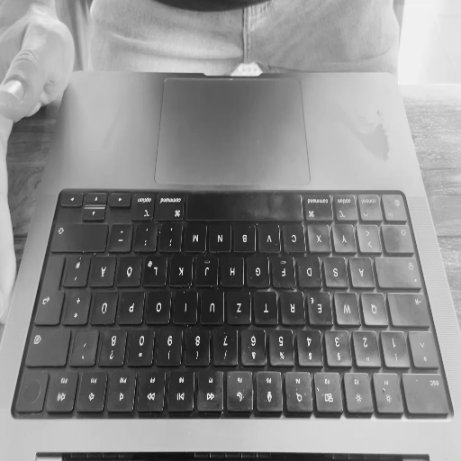

# Training Data

## Data Collection

1. Choose a text-blob from `data/text-blobs/` to type out
2. Go to `data/raw/` directory and run `python key_logger.py` 
3. After completing, terminate the key logger with `Ctrl+C` and rename the `"key_log.csv"` file to `"{text-blob-name}_{your-name}_{number}_{optional-descriptor}.csv"`. Example: `"typing_mixed_1_lucas_1.csv"`
4. Save the video recording of the typing session in `data/raw/` directory with the same name as the csv file. Example: `"typing_mixed_1_lucas_1.mp4"`

> **Note:** It is crucial to keep the csv and video file names consistent for data processing in the next step.

## Data Preprocessing

1. Go to `data/` directory and run `python process_data.py <file-name-1> <file-name-2> ... <file-name-n>`. Example: `python process_data.py typing_mixed_1_lucas_1 typing_mixed_1_lucas_2 typing_mixed_1_lucas_3`
2. For each file, a window will pop up asking you to select the frame where the first key press occurs. This is to match the key press events with the video frames.
3. Two new files will be created in the `data/processed/` directory: `<file-name>.npy` for the inputs and `<file-name>_labels.npy` for the labels. Example: `typing_mixed_1_lucas_1.npy` and `typing_mixed_1_lucas_1_labels.npy`. Furthermore, the `keys.names` file will be updated with any new keys found in the data.

    
    

        <i>Example of a Preprocessed Video Frame<i>
    

# Training

TODO

# Evaluation

TODO

---

# Notes

- Key-press detection
- Features
    1. Detect Motion of object pressing down the key
    2. Detect change in shadow of key
- Invariants
    - Motion Duration ~100-200 milliseconds
    - Essentially Stateless
        - Keypress should be treated independent of previous key presses
        - Only memory: key-down event will be followed by key-up event, likely in the next 100 milliseconds.
