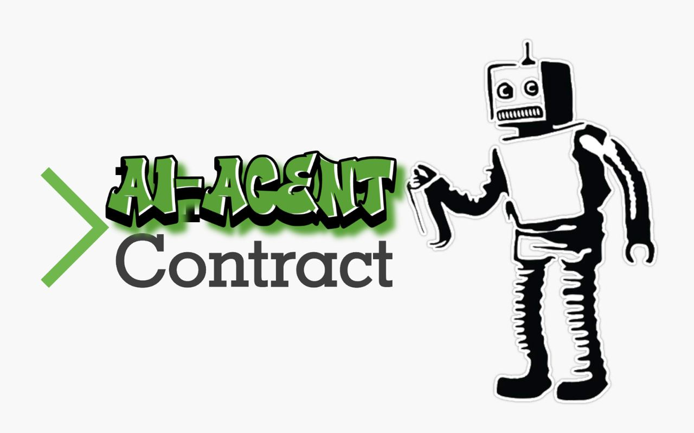

<div align="center">
  <a href="https://github.com/Phala-Network/ai-agent-contract-viem">
    <h1>AI Agent Contract Template + Viem SDK</h1>
    
    <br />
  </a>
  <p align="center">
    Host your AI Agent Contract on Phala's decentralized serverless cloud.
    <br />
    <a href="https://github.com/Phala-Network/ai-agent-contract-viem"><strong>Explore the docs »</strong></a>
    <br />
    <br />
    <a href="https://wapo-testnet.phala.network/ipfs/QmPQJD5zv3cYDRM25uGAVjLvXGNyQf9Vonz7rqkQB52Jae?key=b092532592cbd0cf&type=verify&data=signedByTEE&signature=0x27a9cd3e1aa3b238c8bdbc57d831f503b9af11ba2cc4875780c21ea8a14b471c098d11791709f6243001908bfe217644c6b3882a16903048e9e01e946b318c0d1b">View Demo</a>
    ·
    <a href="https://github.com/Phala-Network/ai-agent-contract-viem/issues">Report Bug</a>
    ·
    <a href="https://discord.gg/phala-network">Discord</a>
  </p>

  <h3>Architecure Overview</h3>
  
</div>

## 🤖 What Is This?!

<div align="center">
  
</div>

The AI Agent Contract Viem SDK template is a **MINIMAL** template to build an AI Agent that can be hosted on Phala Network's decentralized hosting protocol. Unlike Vercel or other FaaS, it allows you to publish your AI Agent compiled code to IPFS and hosts it on a fully decentralized FaaS cloud with the following benefits:

- 💨 Ship Fast: Build and ship with familiar toolchain in minutes
- ⛑️ Secure: Execution guarded by rock solid TEE / Intel SGX
- 🔒 Private: Host API keys and user privacy at ease
- 💎 Unstoppable: Powered by IPFS and Phala's 35k+ decentralized TEE workers
- :fire: [**hono/tiny** Support](https://hono.dev/docs/api/presets#hono-tiny): a small, simple, and ultrafast web framework built on Web Standards.
- 🧪: [Vite Test Framework](https://vitest.dev/guide/): Vite Testing Framework support, but your free to change the test framework to your desire.

> **NOTICE**
>
> We recommend using @hono/tiny to avoid a large bundle size and the 20MB final artifact limitation.

[//]: # ()

## Getting Started
### Prepare
Install dependencies
```shell
npm install
```

### Testing Locally
Create `.env` file with the default ThirdWeb API key for publishing your Agent Contract to IPFS
```shell
cp .env.example .env
```

Build your Agent
```shell
npm run build
```

Test your Agent locally
```shell
npm run test
```

Expected Test Results
```shell
Now you are ready to publish your agent, add secrets, and interact with your agent in the following steps:
- Execute: 'npm run publish-agent'
- Set secrets: 'npm run set-secrets'
- Go to the url produced by setting the secrets (e.g. https://wapo-testnet.phala.network/ipfs/QmPQJD5zv3cYDRM25uGAVjLvXGNyQf9Vonz7rqkQB52Jae?key=b092532592cbd0cf)

 ✓ tests/index.test.ts (5) 7035ms
   ✓ Test Viem SDK AI Agent Contract (5) 7035ms
     ✓ Derive Account
     ✓ Sign Message Data
     ✓ Verify Signature
     ✓ Send TX on Base Sepolia 6991ms
     ✓ POST /

 Test Files  1 passed (1)
      Tests  5 passed (5)
   Start at  16:40:10
   Duration  7.39s (transform 34ms, setup 6ms, collect 181ms, tests 7.04s, environment 0ms, prepare 42ms)
```

### Publish Your AI Agent

Upload your compiled AI Agent code to IPFS.
```shell
npm run publish-agent
```

Upon a successful upload, the command should show the URL to access your AI Agent.
```shell
- Uploading file to IPFS. This may take a while depending on file sizes.

✔ Successfully uploaded file to IPFS.
✔ Files stored at the following IPFS URI: ipfs://QmVJ3xknfRevUkc68iZc4RdPSLL2gLD8WagwMQCdGMyC4g
✔ Open this link to view your upload: https://b805a9b72767504353244e0422c2b5f9.ipfscdn.io/ipfs/bafybeidhk5nzutxyx3xusgjl4v6nkvscdoiowzofc7hqnf3l4xipieshie/

Agent Contract deployed at: https://wapo-testnet.phala.network/ipfs/QmVJ3xknfRevUkc68iZc4RdPSLL2gLD8WagwMQCdGMyC4g

If your agent requires secrets, ensure to do the following:
1) Edit the ./secrets/default.json file or create a new JSON file in the ./secrets folder and add your secrets to it.
2) Run command: 'npm run set-secrets' or 'npm run set-secrets [path-to-json-file]'
Deployment information updated in ./logs/latestDeployment.json
```

> :information_source: Note that your latest deployment information will be logged to in file [`./logs/latestDeployment.json`](./logs/latestDeployment.json). This file is updated every time you publish a new Agent Contract to IPFS. This file is also used to get the IPFS CID of your Agent Contract when setting secrets for your Agent Contract.
> 
> Here is an example:
> ```json
> {
>   "date": "2024-08-29T03:55:04.278Z",
>   "cid": "Qmb2Mn72sY9h8ew6Ld5bW13Fknzge3hssRetJTUWyyoma7",
>   "url": "https://wapo-testnet.phala.network/ipfs/Qmb2Mn72sY9h8ew6Ld5bW13Fknzge3hssRetJTUWyyoma7"
> }
> ```

<details>
<summary>New to Thirdweb?</summary>
We use <a href="https://thirdweb.com/dashboard/infrastructure/storage">thirdweb Storage</a> to host IPFS contents. If you are new to thirdweb, the command will guide you to create your account or login to your existing account from the browser.
</details>

> **Did Thirdweb fail to publish?**
> 
> If ThirdWeb fails to publish, please signup for your own ThirdWeb account to publish your Agent Contract to IPFS. Signup or login at https://thirdweb.com/dashboard/ 
> 
> Whenever you log into ThirdWeb, create a new API key and replace the default API Key with yours in the [.env](./.env) file.
>
> ```
> THIRDWEB_API_KEY="YOUR_THIRDWEB_API_KEY"
> ```


### Access the Published AI Agent

Once published, your AI Agent is available at the URL: `https://wapo-testnet.phala.network/ipfs/<your-cid>`. You can get it from the "Publish to IPFS" step.

You can test it with `curl`.

```bash
curl https://wapo-testnet.phala.network/ipfs/<your-cid>
```

### Add Secrets

By default, all the compiled JS code is visible for anyone to view if they look at IPFS CID. This makes private info like API keys, signer keys, etc. vulnerable to be stolen. To protect devs from leaking keys, we have added a field called `secret` in the `Request` object. It allows you to store secrets in a vault for your AI Agent to access.

To add your secrets, 
1) Edit the [default.json](./secrets/default.json) file or create a new JSON file in the `./secrets` folder and add your secrets to it.
```json
{
  "secretSalt": "SALTY_BAE"
}
```
2) Run command to set the secrets
```shell
npm run set-secrets
# or if you have a custom JSON file
npm run set-secrets <path-to-json-file>
```
Expected output:
```shell
Use default secrets...
Storing secrets...
  % Total    % Received % Xferd  Average Speed   Time    Time     Time  Current
                                 Dload  Upload   Total   Spent    Left  Speed
100   161    0    68  100    93    130    178 --:--:-- --:--:-- --:--:--   309
{"token":"1e7c8d07c412ff89","key":"6978ea391960e272","succeed":true}

Secrets set successfully. Go to the URL below to interact with your agent:
https://wapo-testnet.phala.network/ipfs/QmVJ3xknfRevUkc68iZc4RdPSLL2gLD8WagwMQCdGMyC4g?key=6978ea391960e272
Log entry added to secrets.log
```

> :information_source: Note that all your secrets will be logged in file [`./logs/secrets.log`](./logs/secrets.log). This file is updated every time you add new secrets to your Agent Contract. If you have not published an Agent Contract, yet, this command will fail since there is not a CID to map the secrets to.
>
> Here is an example:
> ```text
> 2024-08-28T19:31:07.011Z, CID: [QmYNXZ7tGijMHvweRjcx5vGPjmMBCfqnaBS7AHQDipymqh], Token: [fc908693f43dbe2f], Key: [18ba50e9c1d5822a], URL: [https://wapo-testnet.phala.network/ipfs/QmYNXZ7tGijMHvweRjcx5vGPjmMBCfqnaBS7AHQDipymqh?key=18ba50e9c1d5822a]
> 2024-08-29T03:22:11.453Z, CID: [QmYNXZ7tGijMHvweRjcx5vGPjmMBCfqnaBS7AHQDipymqh], Token: [d0e96601ea38b6be], Key: [2b5fd724a4de3652], URL: [https://wapo-testnet.phala.network/ipfs/QmYNXZ7tGijMHvweRjcx5vGPjmMBCfqnaBS7AHQDipymqh?key=2b5fd724a4de3652]
> 2024-08-29T03:37:10.033Z, CID: [QmYNXZ7tGijMHvweRjcx5vGPjmMBCfqnaBS7AHQDipymqh], Token: [ec667a69d0df6653], Key: [63d145b3bddf56b4], URL: [https://wapo-testnet.phala.network/ipfs/QmYNXZ7tGijMHvweRjcx5vGPjmMBCfqnaBS7AHQDipymqh?key=63d145b3bddf56b4]
> 2024-08-29T03:53:54.735Z, CID: [QmYNXZ7tGijMHvweRjcx5vGPjmMBCfqnaBS7AHQDipymqh], Token: [b9b53656b1e0293b], Key: [31db5184579e3427], URL: [https://wapo-testnet.phala.network/ipfs/QmYNXZ7tGijMHvweRjcx5vGPjmMBCfqnaBS7AHQDipymqh?key=31db5184579e3427]
> 2024-08-29T03:55:14.959Z, CID: [Qmb2Mn72sY9h8ew6Ld5bW13Fknzge3hssRetJTUWyyoma7], Token: [beb2e71cd4c7997d], Key: [e189f4deee88dcc1], URL: [https://wapo-testnet.phala.network/ipfs/Qmb2Mn72sY9h8ew6Ld5bW13Fknzge3hssRetJTUWyyoma7?key=e189f4deee88dcc1]
> ```

The API returns a `token` and a `key`. The `key` is the id of your secret. It can be used to specify which secret you are going to pass to your frame. The `token` can be used by the developer to access the raw secret. You should never leak the `token`.

<details>
<summary>To verify the secret</summary>
Run the following command where `key` and `token` are replaced with the values from adding your `secret` to the vault.

```shell
curl https://wapo-testnet.phala.network/vaults/<key>/<token>
```

Expected output:
```shell
{"data":{"secretSalt":"<SECRET_SALT>"},"succeed":true}
```

If you are using secrets, make sure that your URL is set in the following syntax where `cid` is the IPFS CID of your compiled JS file and `key` is the `key` from adding secrets to your vault.
```text
https://wapo-testnet.phala.network/ipfs/<cid>?key=<key>
```

</details>

#### Accessing Secrets in Your Code
To access your secrets you will have to get them from secret `vault` via `process.env.secret`. Here is an example of accessing the secret key value of `secretSalt`.
```typescript
let vault: Record<string, string> = {}
try {
  vault = JSON.parse(process.env.secret || '')
} catch (e) {
  console.error(e)
  return c.json({ error: "Failed to parse secrets" })
}
const secretSalt = (vault.secretSalt) ? vault.secretSalt as string : 'SALTY_BAE'
```

#### Example:
- [Derived ECDSA Key](https://wapo-testnet.phala.network/ipfs/QmVJ3xknfRevUkc68iZc4RdPSLL2gLD8WagwMQCdGMyC4g?key=6978ea391960e272)
- [Sign 'signedByTEE'](https://wapo-testnet.phala.network/ipfs/QmVJ3xknfRevUkc68iZc4RdPSLL2gLD8WagwMQCdGMyC4g?key=6978ea391960e272&type=sign&data=signedByTEE)
- [Verify Signature](https://wapo-testnet.phala.network/ipfs/QmVJ3xknfRevUkc68iZc4RdPSLL2gLD8WagwMQCdGMyC4g?key=6978ea391960e272&type=verify&data=signedByTEE&signature=0x9b1b413f1573da2ada426f4da99416b6081ef7246a23990c0c13d764f566083920a4b07636b7d7a582fbc3d98ad42bedc26410764a4cd2963058792121a5d63d1b)
- [Send TX on Base Sepolia](https://wapo-testnet.phala.network/ipfs/QmVJ3xknfRevUkc68iZc4RdPSLL2gLD8WagwMQCdGMyC4g?key=6978ea391960e272&type=sendTx&to=0xC5227Cb20493b97bb02fADb20360fe28F52E2eff&gweiAmount=420)

### Handling Requests
Check the [`Hono` docs](https://hono.dev/docs) for information on accessing URL `queries` or `body` from a `post` request.

> **NOTICE**
>
> We recommend using @hono/tiny to avoid a large bundle size and the 20MB final artifact limitation.

```typescript
// Access query value for a URL query named `type`
let queries = c.req.queries() || {}
const getType = (queries.type) ? queries.type[0] as string : ''
// Access body from post request
const data = await c.req.json()
```

### Debugging

To debug your agent, you can use the following command:
```shell
curl https://wapo-testnet.phala.network/logs/all/ipfs/<CID>
```

After executing this command then you should see some output in the terminal to show the logs of requests to your agent.
```shell
2024-09-04T03:18:34.758Z [95f5ec53-3d71-4bb5-bbb6-66065211102c] [REPORT] END Request: Duration: 166ms
2024-09-04T03:18:34.758Z [95f5ec53-3d71-4bb5-bbb6-66065211102c] [INFO] 'Is signature valid? ' true
2024-09-04T03:18:34.758Z [95f5ec53-3d71-4bb5-bbb6-66065211102c] [INFO] 'Verifying Signature with PublicKey ' '0xC1BF8dB4D06416c43Aca3deB289CF7CC0aAFF540'
2024-09-04T03:18:34.758Z [95f5ec53-3d71-4bb5-bbb6-66065211102c] [REPORT] START Request: GET /ipfs/QmfLpQjxAMsppUX9og7xpmfSKZAZ8zuWJV5g42DmpASSWz?key=0e26a64a1e805bfd&type=verify&data=tintinland%20message%20to%20sign&signature=0x34c4d8c83406e7a292ecc940d60b34c9b11024db10a8872c753b9711cd6dbc8f746da8be9bc2ae0898ebf8f49f48c2ff4ba2a851143c3e4b371647eed32f707b1b
2024-09-04T03:17:15.238Z [768b6fda-f9f1-463f-86bd-a948e002bf80] [REPORT] END Request: Duration: 183ms
2024-09-04T03:17:15.238Z [768b6fda-f9f1-463f-86bd-a948e002bf80] [INFO] 'Signature: 0x34c4d8c83406e7a292ecc940d60b34c9b11024db10a8872c753b9711cd6dbc8f746da8be9bc2ae0898ebf8f49f48c2ff4ba2a851143c3e4b371647eed32f707b1b'
2024-09-04T03:17:15.238Z [768b6fda-f9f1-463f-86bd-a948e002bf80] [INFO] 'Signing data [tintinland message to sign] with Account [0xC1BF8dB4D06416c43Aca3deB289CF7CC0aAFF540]'
2024-09-04T03:17:15.238Z [768b6fda-f9f1-463f-86bd-a948e002bf80] [REPORT] START Request: GET /ipfs/QmfLpQjxAMsppUX9og7xpmfSKZAZ8zuWJV5g42DmpASSWz?key=0e26a64a1e805bfd&type=sign&data=tintinland%20message%20to%20sign
2024-09-04T03:16:38.507Z [3717d307-bff0-4fc0-bc98-8f66c33dd46f] [REPORT] END Request: Duration: 169ms
2024-09-04T03:16:38.507Z [3717d307-bff0-4fc0-bc98-8f66c33dd46f] [REPORT] START Request: GET /ipfs/QmfLpQjxAMsppUX9og7xpmfSKZAZ8zuWJV5g42DmpASSWz?key=0e26a64a1e805bfd
2024-09-04T03:15:00.375Z [793f58f9-f24f-4580-8ebc-04debb7d727f] [REPORT] END Request: Duration: 158ms
2024-09-04T03:15:00.375Z [793f58f9-f24f-4580-8ebc-04debb7d727f] [REPORT] START Request: GET /ipfs/QmfLpQjxAMsppUX9og7xpmfSKZAZ8zuWJV5g42DmpASSWz?key=0e26a64
a1e805bfd
```
To create logs in your Agent Contract, you can use the following syntax in your `index.ts` file.
```typescript
// info logs
console.log('info log message!')
// error logs
console.error('error log message!')
```
For more information check the [MDN docs](https://developer.mozilla.org/en-US/docs/Web/API/console) on `console` object.

### Getting Rugged By The WiFi?! 
Run a local testnet with [`docker` support](https://docs.docker.com/desktop/). All you need to do to get a local testnet started is run:

> **WARNING**
> 
> Running the local testnet may return an error if port `8000` is already in use.

 
```shell
npm run dev
```

#### Make a Request to Your Local Build
```shell
# GET request
curl http://127.0.0.1:8000/local
# GET request with URL queries
curl http://127.0.0.1:8000/local?query1=one&query2=two
# POST request
curl http://127.0.0.1:8000/local -X POST -H 'content-type: application/json' -d '{"foo": "bar"}'
```

#### Add Secrets to Your Local Build
```shell
curl http://127.0.0.1:8000/vaults -H 'Content-Type: application/json' -d '{"cid": "local", "data": {"secretKey":"secretValue"}}'
```

#### Check The Logs of Your Local Build
```shell
curl 'http://127.0.0.1:8000/logs/all/local'
```

## FAQ

<details>
<summary><b>What packages can I use in the AI Agent server?</b></summary>
<ul>
  <li>Most of the npm packages are supported: viem, onchainkit, ….</li>
  <li>Some packages with some advanced features are not supported:</li>
  <ul>
    <li>Memory usage over 100MB</li>
    <li>Web Assembly</li>
    <li>Browser only features: local storage, service workers, etc</li>
  </ul>
</ul>
</details>

<details>
<summary><b>What’s the spec of the Javascript runtime?</b></summary>
<ul>
  <li>The code runs inside a tailored <a href="https://bellard.org/quickjs/">QuickJS engine</a></li>
  <li>Available features: ES2023, async, fetch, setTimeout, setInterval, bigint</li>
  <li> <a href="https://docs.phala.network/tech-specs/ai-agent-contract#wapojs/">Tech spec doc</a></li>
</ul>
</details>

<details>
<summary><b>Why is the serverless platform secure?</b></summary>
<ul>
  <li>Your AI Agent code on is fully secure, private, and permissionless. Nobody can manipulate your program, steal any data from it, or censor it.</li>
  <li>Security: The code is executed in the decentralized TEE network running on Phala Network. It runs code inside a secure blackbox (called enclave) created by the CPU. It generates cryptographic proofs verifiable on Phala blockchain. It proves that the hosted code is exactly the one you deployed.</li>
  <li>Privacy: You can safely put secrets like API keys or user privacy on Phala Network. The code runs inside TEE hardware blackboxs. The memory of the program is fully encrypted by the TEE. It blocks any unauthorized access to your data.</li>
  <li>Learn more at <a href="https://phala.network">Phala Network Homepage</a></li>
</details>

<details>
<summary><b>What's TEE / Intel SGX?</b></summary>
<ul>
  <li><a href="https://collective.flashbots.net/t/tee-sgx-wiki/2019">TEE/SGX wiki</a></li>
  <li><a href="https://collective.flashbots.net/t/debunking-tee-fud-a-brief-defense-of-the-use-of-tees-in-crypto/2931">Debunking TEE FUD: A Brief Defense of The Use of TEEs in Crypto</a></li>
</details>
